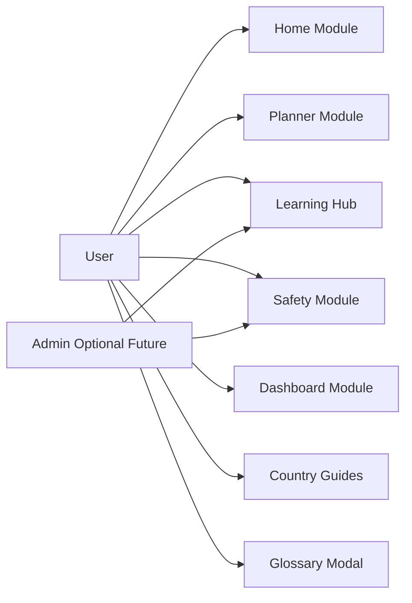
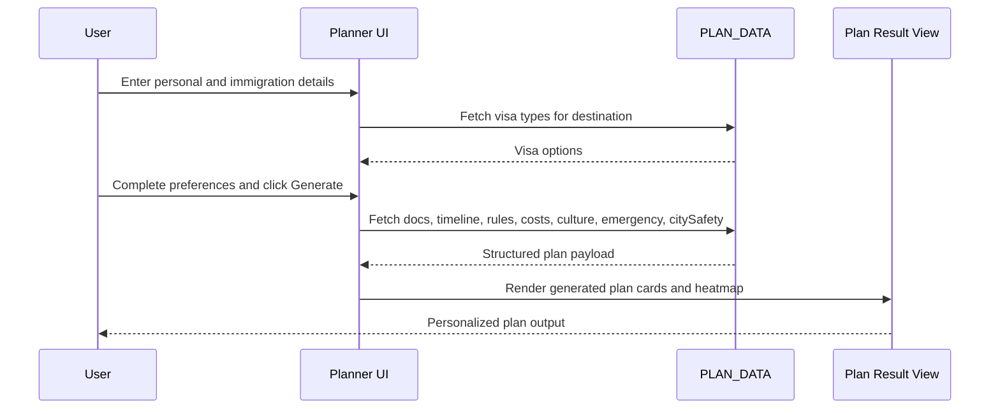
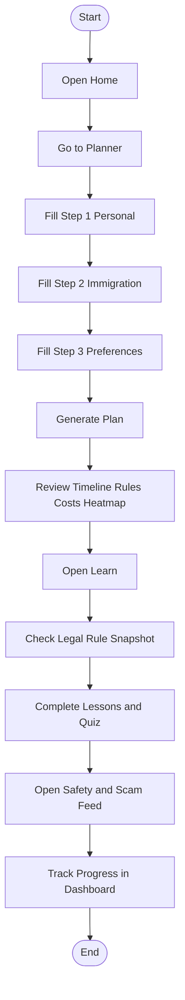
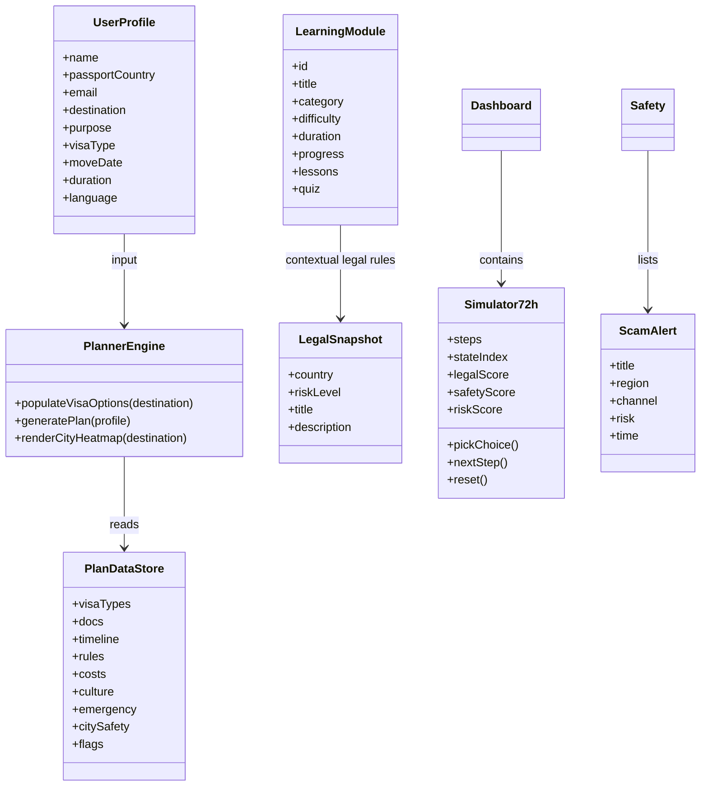
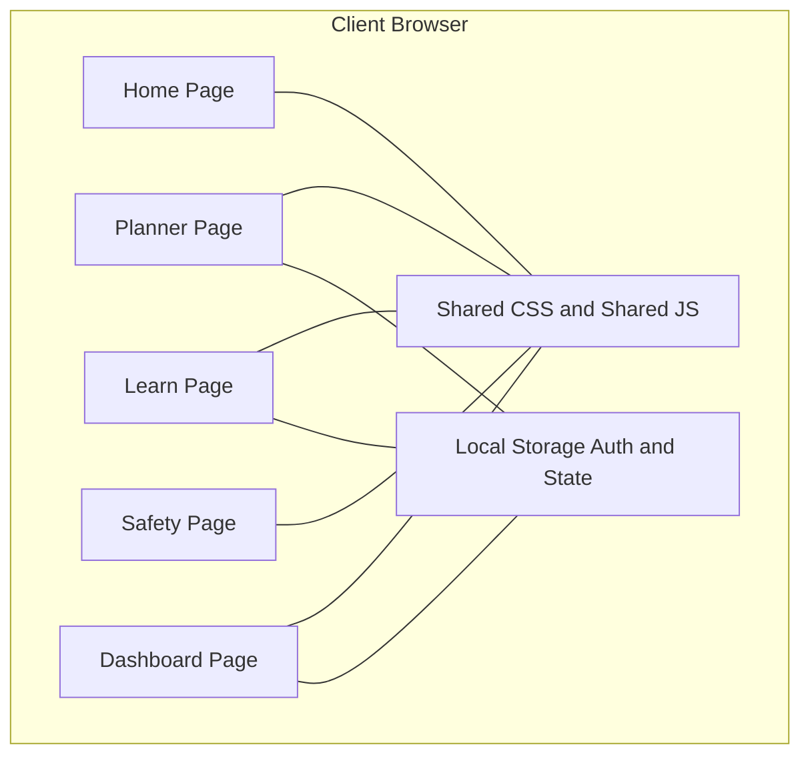
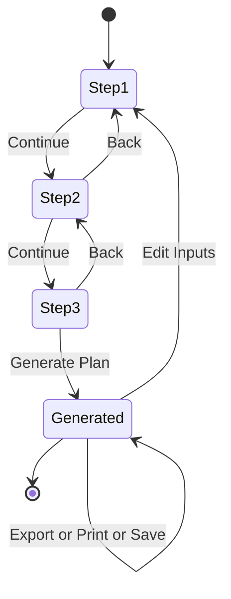
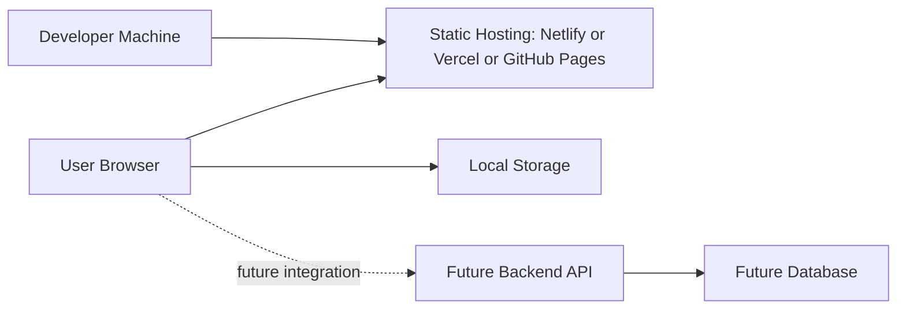

# ImmigrationIQ UML Diagrams

## 1. Use Case Diagram

## 2. Sequence Diagram (Planner to Generated Plan)

## 3. Activity Diagram (End-to-End User Flow)

## 4. Class Diagram (Frontend Logical Model)

## 5. Component Diagram (System Design)

## 6. State Diagram (Planner Form and Result)

## 7. Deployment Diagram (Current + Future)

## 8. Deliverable Note
- This file can be rendered with Mermaid support in Markdown preview.
- You can export it to PDF using VS Code Markdown print/export extensions or browser print to PDF.
